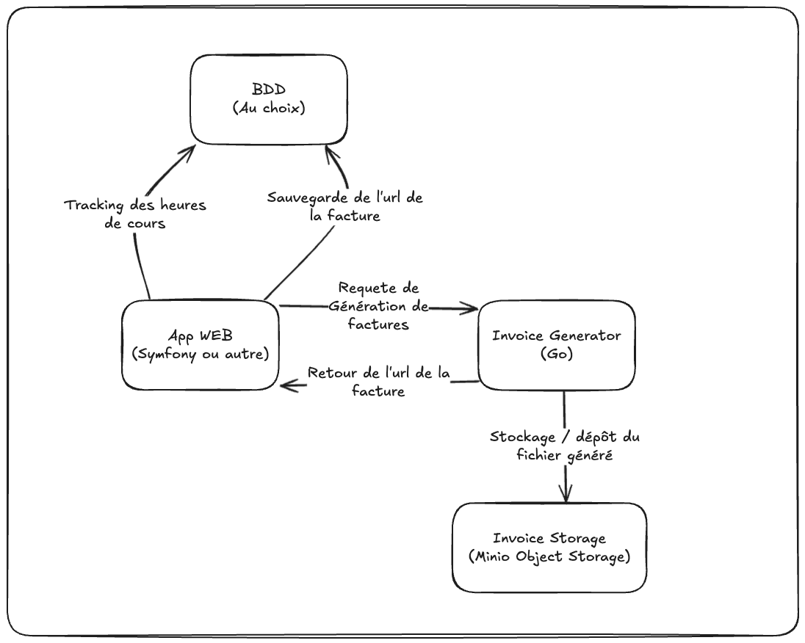

# MS2D - Projet Lazy invoice Editor

## Description
Lazy invoice Editor destiné à créer une interface simple permettant à un formateur d'éditer ces factures 
mensuelles simplement et rapidement.

L'application doit pouvoir:

- Permettre à un formateur de renseigner les heures de cours effectuées (Client/module/date/durée en heures/classe/thm appliqué)
- Calculer le montant total de la facture mensuelle
- Générer un fichier PDF de la facture
- Télécharger les factures générés depuis l'app web
- Stocker les factures générées
- Permettre de consulter les factures générées
- Pouvoir modifier les factures générées:
  - modifier les heures cours effectuées,
  - recalculer le montant total,
  - générer un nouveau PDF

l'application doit pouvoir être déployé dans un environnement Docker et être accessible via un navigateur web.

## Technologies utilisées
- Docker
- Langage au choix pour l'app web
- Base de données au choix
- Génération de PDF avec un outil développer en GO
- Stockage des factures assuré par un service de stockage: Minio ( Systeme de stockage S3 local )

## Schéma de l'application version 1
Le schéma suivant peut être soumis à des modifications en fonction des besoins du projet.

## Ressources

- [Minio Object Storage](https://min.io/docs/minio/linux/developers/go/minio-go.html?ref=docs-redirect)
- [Image Docker Minio](https://hub.docker.com/r/minio/minio)
- [Exemple d'intégration](https://grafikart.fr/tutoriels/s3-minio-docker-2166)
- [Lib Golang PDF - Maroto](https://github.com/johnfercher/maroto)
- [Exemple d'utilisation de Maroto](https://divrhino.com/articles/create-pdf-document-with-go-maroto-gofakeit)